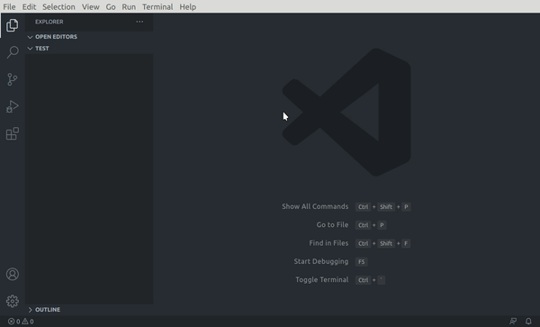

# Python Project Creator


Just as Code Style, API Design, and Automation are essential for a healthy development cycle. Repository structure is a crucial part of your project’s architecture.

When a potential user or contributor lands on your repository’s page, they see a few things:

    Project Name
    Project Description
    Bunch O’ Files

Only when they scroll below the fold will the user see your project’s README.

If your repo is a massive dump of files or a nested mess of directories, they might look elsewhere before even reading your beautiful documentation. Dress for the job you want, not the job you have.

Of course, first impressions aren’t everything. You and your colleagues will spend countless hours working with this repository, eventually becoming intimately familiar with every nook and cranny. The layout is important.

**So, to solve that problem, here it is vs-code extension which create the best possible project structure for you only with one click.**

## How to install

This extenasion is in initial stage, thus to install the extension, Download the vsix file from [here.](https://github.com/iamAbhishekkumar/PPC/releases/download/v0.0.1/ppc-0.0.1.vsix) And run this command :

    code --install-extension ppc-0.0.1.vsix

## How to use



## Known Issues

* "Open in new window" dialog appears way before completion of terminal's task.

* Tested for linux os only.

## Different Structures

* Basic App Structure

```
projectName/
│
├── .gitignore
├── projectName.py
├── LICENSE
├── README.md
├── requirements.txt
├── setup.py
└── tests.py
└── env
``` 


* Installable Package

```
projectName/
│
├── app
│   ├── __init__.py
|   ├── projectName.py
│   └── helpers.py
├── tests
│   ├── folder_name_tests.py
│   └── helpers_tests.py
├── .gitignore
├── LICENSE
├── README.md
├── requirements.txt
└── setup.py
└── env
``` 

* Flask-App: Basic

```
projectName
│
├── app
│   ├── __init__.py
    ├── projectName.py
│   ├── views.py
│   ├── models.py
│   ├── helpers.py
│   └── static
│       └── main.css
│   └── templates
│       └── index.html
├── config.py
├── .gitignore
├── LICENSE
├── README.md
├── requirements.txt
``` 

* Flask-App: Advanced

```
projectName
 ├── app
 │   ├── __init__.py
 |   ├── projectName.py
 │   ├── extensions.py
 │   │
 │   ├── helpers
 │   │   ├── __init__.py
 │   │   ├── views.py
 │   │   ├── models.py
 │   │   └── commands.py
 │   │
 │   ├── auth
 │   │   ├── __init__.py
 │   │   ├── routes.py
 │   │   ├── views.py
 │   │   ├── models.py
 │   │   ├── forms.py
 │   │   └── commands.py
 │   │
 │   └── ui
 │       ├── static
 │       │   ├── css
 │       │   │   └── styles.css
 │       │   └── js
 │       │       └── custom.js
 │       │
 │       └── templates
 │           ├── 404.html
 │           ├── 500.html
 │           └── base.html
 │
 ├── tests
 │   ├── __init__.py
 │   ├── conftest.py
 │   │   
 │   └── auth
 │       ├── __init__.py
 │       └── test_views.py
 │
 ├── config.py
 ├── wsgi.py
 ├── requirements.txt
 └── README.md 
``` 

## References

* [How to structure Flask Applications](https://laymanclass.com/how-to-structure-flask-application-for-larger-projects/)

* [Python Application Layouts](https://realpython.com/python-application-layouts/#django)

**If you like it, :star:this repo :upside_down_face:**

**If you find any issues, feel free to raise issues. Enjoy!:smile:**
